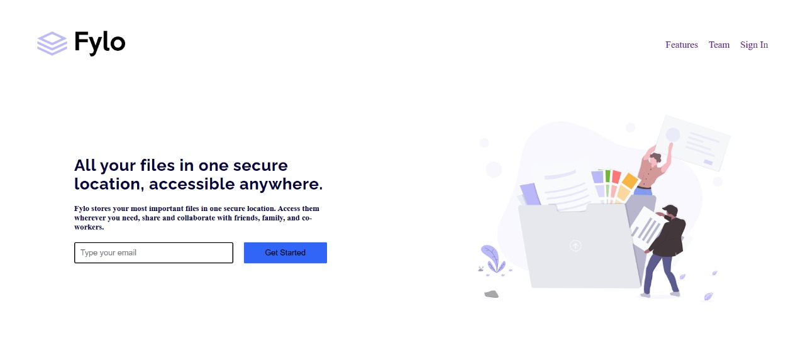

# Frontend Mentor - Fylo landing page with two column layout solution

This is a solution to the [Fylo landing page with two column layout challenge on Frontend Mentor](https://www.frontendmentor.io/challenges/fylo-landing-page-with-two-column-layout-5ca5ef041e82137ec91a50f5). Frontend Mentor challenges help you improve your coding skills by building realistic projects. 
## Overview

### The challenge

Responsive Design: Ensure that the two-column layout adapts gracefully across various screen sizes, making use of CSS Grid and Flexbox to manage the layout effectively.

Hover States: All interactive components, such as buttons and links, should provide clear visual feedback when hovered over, enhancing user experience and accessibility.

### Screenshot

### Links

- Solution URL: [Add solution URL here](https://your-solution-url.com)
- Live Site URL: [Add live site URL here](https://your-live-site-url.com)

## My process

### Built with

- Semantic HTML5 markup
- CSS 
- Flexbox
- Grid
- JavaScript
- Mobile-first workflow

## Author

- Frontend Mentor - https://www.frontendmentor.io/profile/SaquibFurniturewala1

## Acknowledgments

I would like to thank Frontend Mentor for providing excellent challenges like the Fylo landing page with two column layout. Their platform has greatly enhanced my web development skills by offering real-world projects that focus on responsive design and user interface development. 
